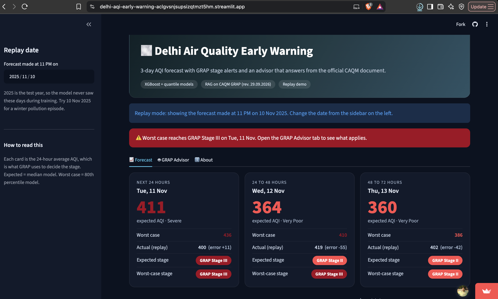
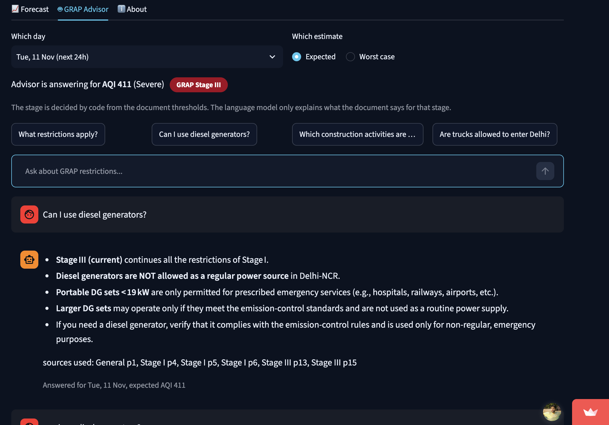
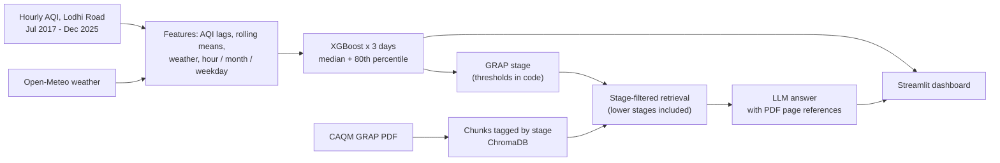

# Delhi AQI Early Warning + GRAP Advisor

**Live demo:** https://delhi-aqi-early-warning-aclgvsnjsupsizqtmzt5hm.streamlit.app

A prototype that forecasts the next 3 days of 24-hour average AQI for Delhi (Lodhi Road station), flags which GRAP stage may apply, and lets you ask questions that are answered from the official CAQM GRAP document.

> The demo is a **replay**, not live data. You pick a past date in 2025, the model forecasts the next 3 days using only data up to that date, and the real values are shown next to the forecast. 2025 was never seen during training.




## What it does

1. **Forecast.** For a chosen date, predicts the 24-hour average AQI for the next 24h, 24 to 48h and 48 to 72h. Two models per day: an *expected* value (median) and a *worst case* (80th percentile).
2. **GRAP stage.** Maps each prediction to a GRAP stage using the AQI thresholds from the CAQM document (Stage I 201-300, II 301-400, III 401-450, IV above 450). This is done in code, not by the language model.
3. **Advisor.** A RAG chatbot over the CAQM GRAP document (revision 29.09.2026). It retrieves the relevant parts for the predicted stage, explains them, and shows which PDF pages it used.

## How it works



**Data**
- Hourly AQI for Lodhi Road (IMD) from OpenCity's Delhi Hourly Air Quality Reports (CPCB data). 2017-2023 is the published AQI.
- 2024-25 only had 15-minute pollutant readings, so I resampled to hourly and **calculated AQI from PM2.5 and PM10** using CPCB breakpoints. This is an approximation of the official AQI.
- Weather (temperature, humidity, wind, pressure, rain) from the Open-Meteo archive.
- Gaps: Jan-Jun 2017 is missing, and about 60 days (monsoon 2025) are missing. Only gaps up to 6 hours were interpolated.

**Forecast models**
- Targets are the next 24h, 24-48h and 48-72h average AQI, because GRAP works on daily average AQI.
- Train on Jul 2017 to Dec 2024, test on 2025. Splits are by time, never random.
- Baseline: the average AQI of the previous 24 hours.

**Advisor**
- The GRAP PDF is split into chunks and every chunk is tagged with its stage (found from the stage headers in the document).
- Retrieval is filtered by stage and **includes the lower stages**, because the document states that earlier-stage actions continue when a higher stage is invoked.
- The language model only explains retrieved text. The prompt tells it to mention exemptions, not to guess numbers from garbled PDF tables, and to say when something was not found.

## Results (held-out year 2025)

Forecast of daily average AQI, compared with the baseline:

| Horizon | MAE model | MAE baseline | Stage accuracy model | Stage accuracy baseline |
|---|---|---|---|---|
| Next 24h | 27.8 | 32.3 | 0.82 | 0.79 |
| 24 to 48h | 37.5 | 44.5 | 0.76 | 0.72 |
| 48 to 72h | 40.8 | 50.9 | 0.75 | 0.68 |

Catching days that reach Stage II or above (recall, with precision in brackets):

| Horizon | Median model | Worst-case model | Baseline |
|---|---|---|---|
| Next 24h | 0.80 (0.77) | 0.91 (0.60) | 0.71 (0.71) |
| 24 to 48h | 0.56 (0.65) | 0.87 (0.54) | 0.59 (0.60) |
| 48 to 72h | 0.49 (0.64) | 0.85 (0.54) | 0.53 (0.54) |

The worst-case model catches many more warnings, at the cost of more false alarms.

**Hourly model comparison** (MAE in AQI points, test year 2025, LSTM trained on 2017-2023 with 2024 for validation, so this comparison is approximate):

| Horizon | LSTM | XGBoost | Persistence |
|---|---|---|---|
| 6h | 45.1 | 40.6 | 53.3 |
| 12h | 47.0 | 43.6 | 61.8 |
| 24h | 45.0 | 45.9 | 52.1 |
| 48h | 49.5 | 50.5 | 62.7 |
| 72h | 53.4 | 54.6 | 67.1 |

Both beat persistence. The LSTM was about equal to XGBoost at longer horizons and worse at short ones, so the dashboard uses XGBoost.

## What went wrong along the way

- **Two AQI series that were not comparable.** My first calculated AQI for 2024-25 used a 24-hour rolling mean, which made it far smoother than the published 2017-2023 series (average hourly change about 2 points versus about 20). Early results looked better than they were. After switching to an hourly calculation both parts behaved alike, and I re-ran everything.
- **Live data with modelled air quality did not work.** I tested Open-Meteo's CAMS air quality data as a live input. Its correlation with the station's PM2.5 was only 0.39 (PM10 about 0.01) and the bias changed with the season, so I did not use it.
- **Predicting the change in AQI instead of the level** gave no improvement, so I kept the simple target.

## Limitations

- **Replay only.** No live data yet. A live version needs the last 72 hours of hourly PM2.5 and PM10 from a station source.
- **Severe days are not caught reliably.** Stage III and IV days are rare in the test year (about 105 hourly rows) and the models mostly miss them, especially 2 and 3 days ahead. Treat the output as an early hint for Stage II, not as a severe-day predictor.
- One station and one test year. Consecutive hourly rows are correlated, so the number of independent test days is much smaller than the row count.
- 2024-25 AQI is calculated from PM2.5 and PM10 only.
- The advisor can misread tables in the PDF (for example the diesel generator capacity table). Always confirm on the official document.
- **Not official advice.** Check [caqm.nic.in](https://caqm.nic.in) for the actual orders.

## Project structure

```
app.py                  Streamlit dashboard
src/forecast.py         features, prediction, GRAP stage thresholds
src/advisor.py          retrieval + LLM answer
models/                 saved XGBoost models (median and 80th percentile) and the LSTM
chroma_grap_v2/         vector store of the GRAP document
docs/grap.pdf           CAQM GRAP document (revision 29.09.2026)
data/raw/               hourly AQI + weather used by the dashboard
notebooks/              data prep, baselines, LSTM, RAG, tests
```

## Run locally

```bash
python -m venv venv
source venv/bin/activate
pip install -r requirements.txt
```

Create a `.env` file in the project root:

```
GROQ_API_KEY=your_key
GROQ_MODEL=model_name_from_groq_console
```

```bash
streamlit run app.py
```

The notebooks need a few extra packages (torch, matplotlib, requests, pypdf, langchain-community, langchain-text-splitters).

The public demo allows 10 questions per session to protect the shared API quota.

## Next steps

- Live mode with station data for the last 72 hours.
- More stations and more years, and better handling of severe days.
- A fixed list of test questions to score the advisor's answers against the PDF.
- Blend the LSTM and XGBoost forecasts.

## Data and sources

- Hourly air quality: OpenCity, Delhi Hourly Air Quality Reports (CPCB).
- Weather: Open-Meteo.
- GRAP: Commission for Air Quality Management in NCR and Adjoining Areas (CAQM).

Built by Najeeb Ahmad.
